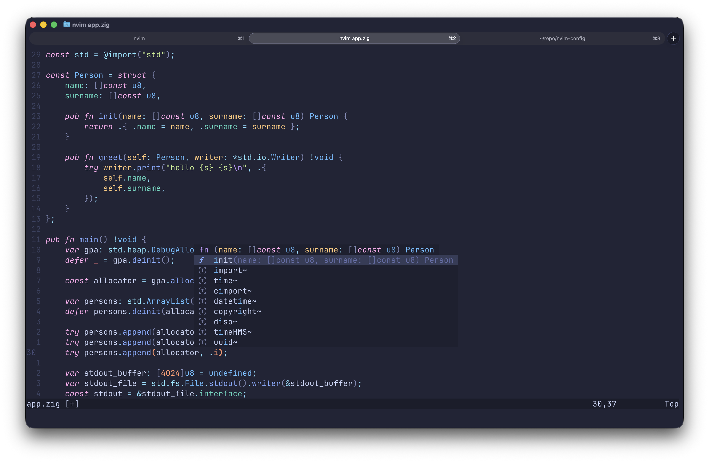

# Neovim config



> Started as fennel experimentation, ended as my main nvim config 💀

## How to

```sh
git clone https://github.com/AlphaTechnolog/nvim.git --depth=1 $HOME/.config/nvim
nvim
```

> [!NOTE]
> If installation errors out with some `vim.pack` related issues, or anything, please try using neovim nightly instead, on macos you can use the [bob package manager](https://github.com/MordechaiHadad/bob)
